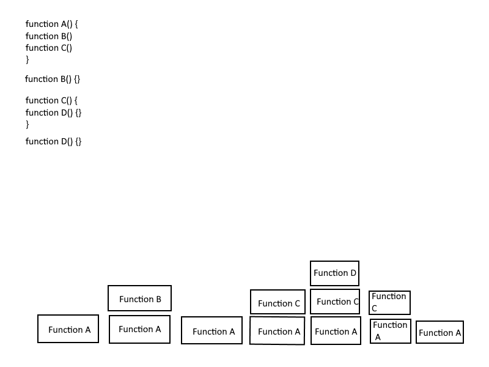

# Read-10 notes

## Notes on [call stack](https://www.freecodecamp.org/news/understanding-the-javascript-call-stack-861e41ae61d4/)

1. What is a ‘call’?
  - The 'call' keeps a record of all each stack frame, so it knows what function needs to be runnning at any given time
1. How many ‘calls’ can happen at once?
  - JavaScript is single-threaded so it can only do one call at once
1. What does LIFO mean?
  - Last in, First out. When a new function is added to the stack, it will finish in entirety before the previous one can finish
1. Draw an example of a call stack and the functions that would need to be invoked to generate that call stack.

1. What causes a Stack Overflow?
  - This occurs when there is a recursive function, a function that repeats itself without an exit point

## Notes on [error messages](https://codeburst.io/javascript-error-messages-debugging-d23f84f0ae7c)

1. What is a ‘refrence error’?
  - This is what you get when you use a variable that hasn't been declared yet
1. What is a ‘syntax error’?
  - This happens when you try to parse an invalid object using json.parse for example, but means you should use a different syntax
1. What is a ‘range error’?
  - When you try to give an object some invalid length
1. What is a ‘type error’?
  - That happens when the data type you are trying to access is incompatable with the functionality you are trying to use it for
1. What is a breakpoint?
  - This allows easier debugging for the line you add it on, it will make your program stop running when it hits that point and you can 'fiddle' with it in the developer console.
1. What does the word ‘debugger’ do in your code?
  - You need this keyword for adding a breakpoint
    
[<-- Back](ToC.md)